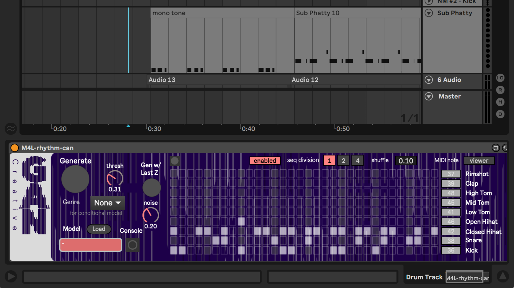

# M4L-CreativeGAN-Rhythm

An Ableton Live Device for Creative-GAN-based rhythm generation models trained with [CreativeGAN-Rhythm repository](https://github.com/naotokui/CreativeGAN-Rhythm).

# Download Ableton Live Device(M4L) and pre-trained tfjs models
You can find an exported M4L device and models [here](https://github.com/naotokui/M4L-CreativeGAN-Rhythm/tree/master/releases). 

# How it works

# Project Page
https://cclab.sfc.keio.ac.jp/projects/rhythmcan/

# Design
Title logo, Background Texture: [Naoki Ise](http://naokiise.com/) 